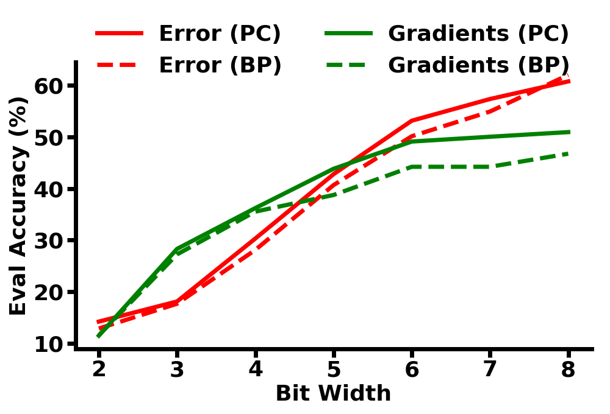

# CIFAR10 Training with Predicive Coding


<p align="center">

</p>


## Reproduce Results

```
./run_noise_sweeps.sh 
python figures.py
```

## Requirements

```
pip install --user absl clu ml_collections jax flax tensorflow tensorflow_datasets
```


## References

Millidge, B., Tschantz, A., & Buckley, C. L. (2020). Predictive coding approximates backprop along arbitrary computation graphs. arXiv preprint arXiv:2006.04182.
